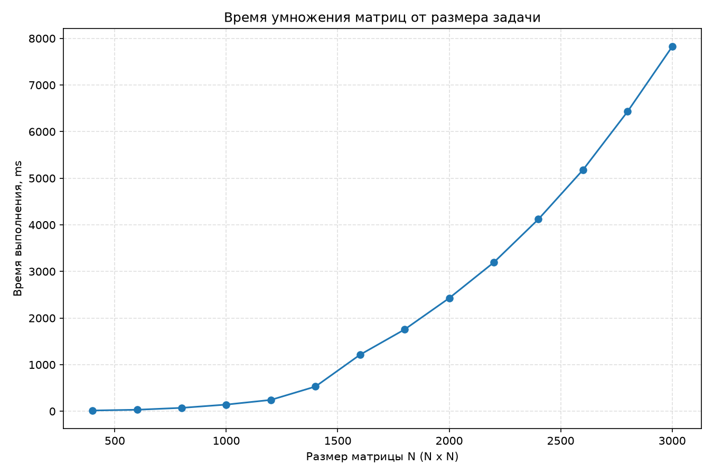
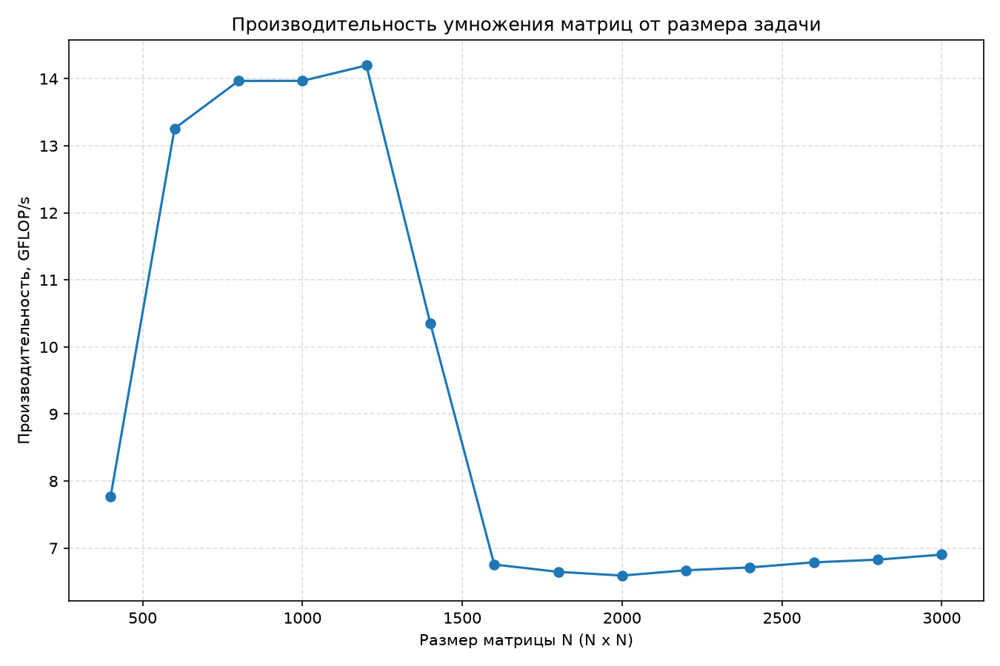

# Лабораторная работа 1

Общие требования, подход к исследованию и методика проведения замеров описаны в [корневом README.md](../../README.md).

## Задача

Написать на C++ (или C) алгоритм, вычисляющий произведение двух квадратных матриц одинаковой размерности с помощью тройного цикла (однопоточная реализация). Измерить время выполнения и другие показатели производительности разработанного алгоритма. Результат работы алгоритма необходимо верифицировать с помощью сторонних библиотек на языке Python.

## Алгоритм

В однопоточном режиме произведение матриц вычисляется с помощью тройного цикла. Матрицы хранятся в формате row-major и имеют тип `double`.

```cpp
const std::uint32_t n = a.get_rows();
const std::uint32_t m = a.get_columns();
const std::uint32_t p = b.get_columns();

matrix::Matrix result(n, p);

for (std::uint32_t i = 0; i < n; ++i)
{
    for (std::uint32_t k = 0; k < m; ++k)
    {
        const double a_ik = a(i, k);

        for (std::uint32_t j = 0; j < p; ++j)
        {
            result(i, j) += a_ik * b(k, j);
        }
    }
}
```

На каждой итерации фиксируются строка `i` матрицы `a` и индекс `k`, после чего внутренний цикл по `j` обновляет все элементы строки `i` матрицы `result`, используя одно значение `a[i][k]`. Такой порядок циклов позволяет эффективно использовать последовательный доступ к памяти: элементы `b` и `result` перебираются последовательно, а значение `a[i][k]` загружается один раз на каждой итерации по `k`.

### Предварительная оценка алгоритма

* `O(n * m * p)` — асимптотическая сложность алгоритма по времени;
* `O(n * p)` — дополнительный объём памяти, необходимый для хранения результирующей матрицы.

Для квадратных матриц одинаковой размерности `N` временная сложность упрощается до `O(N³)`, а объём памяти для результирующей матрицы — до `O(N²)`.

## Технические характеристики устройства

```text
Kernel: Linux 6.18.48-1-cachyos-lts
Shell: fish 4.9.3
CPU: AMD Ryzen 5 7535HS (12) @ 4.60 GHz
GPU 1: NVIDIA GeForce RTX 4060 Max-Q / Mobile [Discrete]
GPU 2: AMD Radeon 680M [Integrated]
Memory: 14.86 GiB
```

## Результаты

| Размер N | Время выполнения, с | FLOP (операций) | Производительность, GFLOP/с | Память (A+B+result), МиБ | Макс. абс. ошибка | Корректность |
| -------: | ------------------: | --------------: | --------------------------: | -----------------------: | ----------------: | :----------: |
|      400 |             0.01647 |     128 000 000 |                        7.77 |                     3.66 |          4.32e-12 |     True     |
|      600 |             0.03259 |     432 000 000 |                       13.26 |                     8.24 |          6.82e-12 |     True     |
|      800 |             0.07332 |   1 024 000 000 |                       13.97 |                    14.65 |          1.09e-11 |     True     |
|     1000 |             0.14318 |   2 000 000 000 |                       13.97 |                    22.89 |          1.23e-11 |     True     |
|     1200 |             0.24342 |   3 456 000 000 |                       14.20 |                    32.96 |          1.64e-11 |     True     |
|     1400 |             0.53006 |   5 488 000 000 |                       10.35 |                    44.86 |          2.00e-11 |     True     |
|     1600 |             1.21267 |   8 192 000 000 |                        6.76 |                    58.59 |          2.82e-11 |     True     |
|     1800 |             1.75500 |  11 664 000 000 |                        6.65 |                    74.16 |          2.36e-11 |     True     |
|     2000 |             2.42765 |  16 000 000 000 |                        6.59 |                    91.55 |          3.27e-11 |     True     |
|     2200 |             3.19316 |  21 296 000 000 |                        6.67 |                   110.78 |          3.64e-11 |     True     |
|     2400 |             4.11921 |  27 648 000 000 |                        6.71 |                   131.84 |          3.73e-11 |     True     |
|     2600 |             5.17852 |  35 152 000 000 |                        6.79 |                   154.72 |          4.00e-11 |     True     |
|     2800 |             6.42991 |  43 904 000 000 |                        6.83 |                   179.44 |          4.18e-11 |     True     |
|     3000 |             7.82243 |  54 000 000 000 |                        6.90 |                   205.99 |          5.46e-11 |     True     |

*Полная таблица результатов также доступна в файле [general.csv](../results/lab_01/general.csv).*

Основные результаты экспериментов:

* суммарное число операций (FLOP): 230 384 000 000 (≈230,4 млрд);
* суммарное время выполнения: 33,18 с;
* средняя производительность (суммарный FLOP / суммарное время): ≈6,94 GFLOP/с;
* пиковая производительность: ≈14,20 GFLOP/с (при `N = 1200`);
* минимальная производительность: ≈6,59 GFLOP/с (при `N = 2000`);
* максимальная абсолютная ошибка по всем запускам: 5,46·10⁻¹¹, что значительно меньше заданного допуска `atol = 1e-6`;
* все 14 запусков признаны корректными (`valid = True`).

### Итоговая оценка алгоритма

* `O(n * m * p)` — асимптотическая сложность алгоритма по времени;
* `O(n * p)` — дополнительный объём памяти, необходимый для хранения результирующей матрицы.

Для квадратных матриц одинаковой размерности `N`:

* временная сложность — `O(N³)`;
* объём памяти для результирующей матрицы — `O(N²)`.

## Анализ графиков

Графики построены с помощью Python и библиотеки Matplotlib.



**Рисунок 1 — Зависимость времени выполнения от размера матрицы**

По графику видно, что с увеличением размера матрицы время выполнения растёт нелинейно, что соответствует теоретической кубической временной сложности `O(N³)` тройного цикла.



**Рисунок 2 — Зависимость производительности (GFLOP/с) от размера матрицы**

График показывает изменение производительности в зависимости от размера задачи. При увеличении `N` от 400 до 1200 производительность возрастает с 7,77 до 14,20 GFLOP/с. Начиная с `N = 1400`, наблюдается заметное снижение производительности: при `N = 1600` она составляет около 6,76 GFLOP/с.

Такое изменение производительности может быть связано с увеличением рабочего набора данных и изменением характера использования кэш-памяти процессора. При дальнейшем увеличении размера матрицы производительность стабилизируется в диапазоне примерно 6,6–6,9 GFLOP/с.

Для однозначного утверждения о том, что причиной снижения производительности является именно ограничение пропускной способности оперативной памяти, необходимы дополнительные измерения, например оценка количества кэш-промахов и фактической пропускной способности памяти.

## Выводы

* Однопоточная реализация алгоритма корректно выполнила вычисления во всех 14 запусках. Максимальная абсолютная ошибка составила 5,46·10⁻¹¹ при допустимом значении `atol = 1e-6`.
* Экспериментальные результаты согласуются с кубической зависимостью времени выполнения от размера матрицы, соответствующей теоретической сложности `O(N³)` тройного цикла.
* Производительность алгоритма зависит от размера задачи. Максимальное измеренное значение составило ≈14,20 GFLOP/с при `N = 1200`. При дальнейшем увеличении размера матрицы наблюдается снижение производительности до диапазона примерно 6,6–6,9 GFLOP/с.
* Наблюдаемое изменение производительности может быть связано с особенностями работы кэш-памяти и увеличением рабочего набора данных. Для точного определения факторов, ограничивающих производительность, необходимы дополнительные аппаратные измерения.
* Средняя производительность по всем экспериментам составила ≈6,94 GFLOP/с и была рассчитана как отношение суммарного количества операций к суммарному времени выполнения.