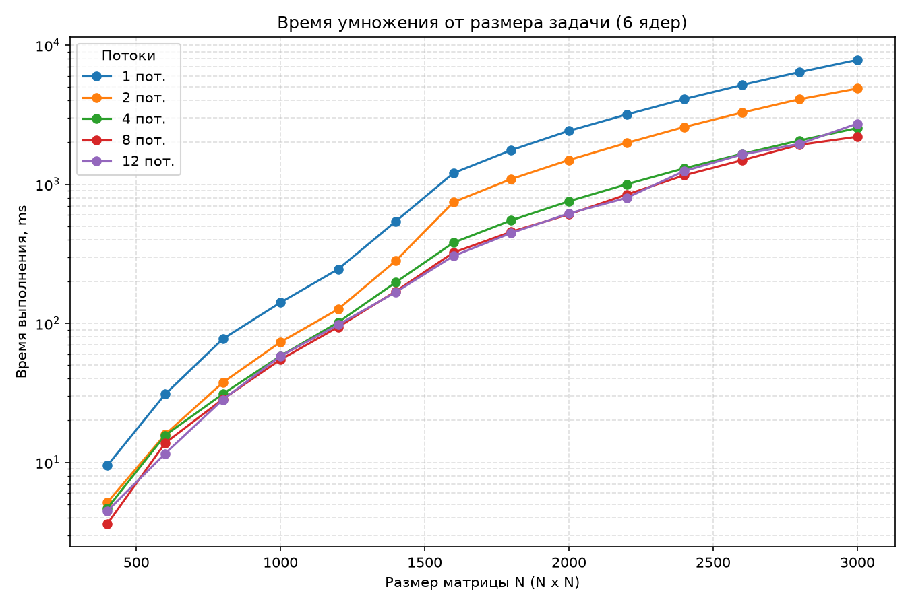
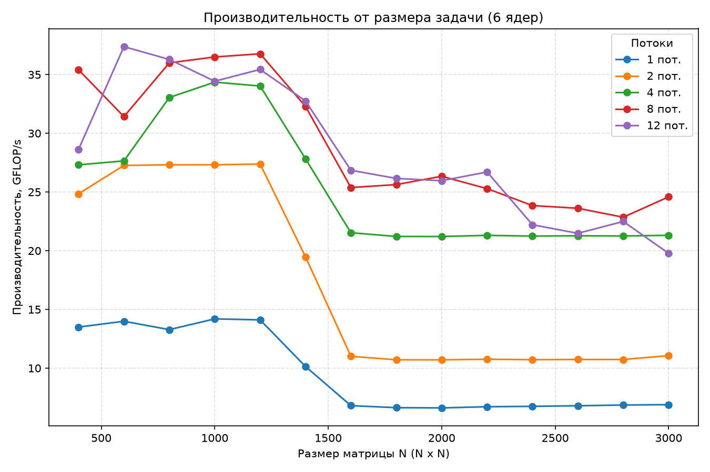
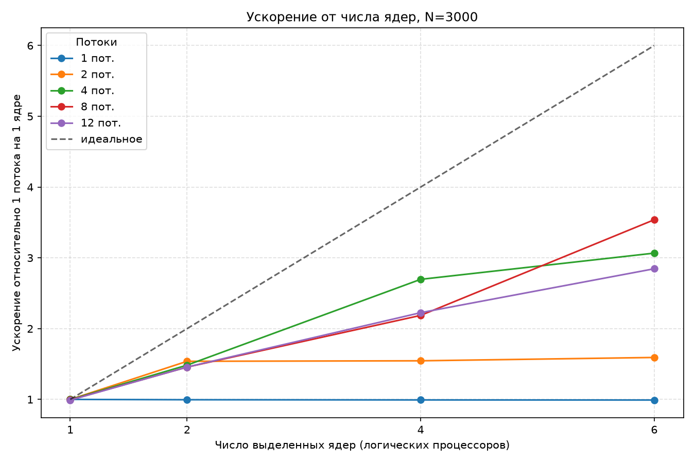
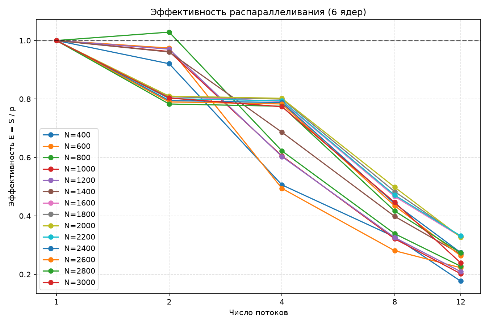

# Лабораторная работа 2

Общие требования, подход к исследованию и методика проведения замеров описаны в [корневом README.md](../../README.md).

## Задача

Распараллелить алгоритм умножения двух квадратных матриц с помощью OpenMP и исследовать зависимость времени выполнения, ускорения `S` и эффективности `E` распараллеливания от размера матрицы, числа потоков и числа процессоров, выделенных процессу. Результат работы алгоритма необходимо верифицировать с помощью сторонних библиотек на языке Python.

## Алгоритм

Используется тот же тройной цикл, что и в [лабораторной работе 1](../lab_01/README.md): для строки `i` матрицы `a` и строки `k` матрицы `b` внутренний цикл по `j` обновляет все элементы строки `i` результирующей матрицы.

Распараллеливание выполняется директивой OpenMP по внешнему циклу `i`: каждый поток обрабатывает свой диапазон строк результирующей матрицы независимо от остальных. Это исключает необходимость синхронизации между потоками непосредственно в процессе умножения. При этом в конце конструкции `parallel for` присутствует неявный барьер OpenMP.

```cpp
#pragma omp parallel for num_threads(threads) schedule(static)

for (std::uint64_t i = 0; i < n; ++i)
{
    for (std::uint32_t k = 0; k < m; ++k)
    {
        const double a_ik = a(i, k);

        for (std::uint32_t j = 0; j < p; ++j)
        {
            result(i, j) += a_ik * b(k, j);
        }
    }
}
```

На каждой итерации фиксируются строка `i` матрицы `a` и индекс `k`. После этого внутренний цикл по `j` обновляет все элементы строки `i` матрицы `result`, используя одно значение `a[i][k]`. Такой порядок циклов позволяет эффективно использовать последовательный доступ к памяти: элементы `b` и `result` перебираются последовательно, а значение `a[i][k]` загружается один раз на каждой итерации по `k`.

Число потоков `threads` задаётся параметром OpenMP. Число процессоров, доступных процессу `cores`, ограничивается снаружи с помощью `taskset -c`. Это позволяет отдельно исследовать влияние числа потоков при фиксированном числе доступных процессоров и влияние количества доступных процессоров на производительность.

### Предварительная оценка алгоритма

* `O(n * m * p / threads)` — ожидаемая временная сложность вычислительной части при эффективном распараллеливании и `threads ≤ cores`;
* `O(n * p)` — дополнительный объём памяти, необходимый для хранения результирующей матрицы и не зависящий от числа потоков.

Для квадратных матриц одинаковой размерности `N` временная сложность последовательного алгоритма составляет `O(N³)`, а при идеальном распараллеливании — `O(N³ / threads)`.

## Технические характеристики устройства

```text
Kernel: Linux 6.18.48-1-cachyos-lts
Shell: fish 4.9.3
CPU: AMD Ryzen 5 7535HS (12) @ 4.60 GHz
GPU 1: NVIDIA GeForce RTX 4060 Max-Q / Mobile [Discrete]
GPU 2: AMD Radeon 680M [Integrated]
Memory: 14.86 GiB
```

## Результаты

Из 280 запусков все 280 признаны корректными (`valid = True`). Максимальная абсолютная ошибка по всем запускам составила 5,46·10⁻¹¹, что значительно меньше заданного допуска `atol = 1e-6`.

### 1 ядро

#### Время, с

| N / потоки |       1 |        2 |        4 |        8 |       12 |
| ---------- | ------: | -------: | -------: | -------: | -------: |
| 400        | 0.01604 | 0.009586 | 0.009575 | 0.009691 | 0.009708 |
| 600        | 0.03208 |  0.03135 |  0.03161 |  0.03163 |   0.0314 |
| 800        | 0.07328 |  0.07338 |   0.0735 |  0.07348 |  0.07392 |
| 1000       |  0.1419 |   0.1421 |   0.1411 |   0.1411 |   0.1419 |
| 1200       |  0.2473 |   0.2487 |   0.2489 |   0.2468 |   0.2488 |
| 1400       |   0.554 |   0.5453 |   0.5478 |   0.5439 |   0.5381 |
| 1600       |   1.215 |    1.216 |    1.215 |    1.216 |    1.211 |
| 1800       |    1.76 |    1.764 |    1.764 |    1.763 |    1.762 |
| 2000       |   2.416 |     2.42 |    2.419 |    2.417 |    2.449 |
| 2200       |   3.165 |    3.164 |    3.162 |    3.168 |    3.172 |
| 2400       |    4.08 |    4.088 |    4.094 |    4.089 |    4.091 |
| 2600       |   5.125 |    5.127 |    5.131 |    5.144 |    5.132 |
| 2800       |   6.351 |    6.351 |    6.363 |    6.383 |    6.391 |
| 3000       |    7.77 |    7.775 |    7.776 |    7.817 |     7.85 |

#### Ускорение S

| N / потоки |    1 |    2 |    4 |    8 |   12 |
| ---------- | ---: | ---: | ---: | ---: | ---: |
| 400        | 1.00 | 1.67 | 1.68 | 1.66 | 1.65 |
| 600        | 1.00 | 1.02 | 1.01 | 1.01 | 1.02 |
| 800        | 1.00 | 1.00 | 1.00 | 1.00 | 0.99 |
| 1000       | 1.00 | 1.00 | 1.01 | 1.01 | 1.00 |
| 1200       | 1.00 | 0.99 | 0.99 | 1.00 | 0.99 |
| 1400       | 1.00 | 1.02 | 1.01 | 1.02 | 1.03 |
| 1600       | 1.00 | 1.00 | 1.00 | 1.00 | 1.00 |
| 1800       | 1.00 | 1.00 | 1.00 | 1.00 | 1.00 |
| 2000       | 1.00 | 1.00 | 1.00 | 1.00 | 0.99 |
| 2200       | 1.00 | 1.00 | 1.00 | 1.00 | 1.00 |
| 2400       | 1.00 | 1.00 | 1.00 | 1.00 | 1.00 |
| 2600       | 1.00 | 1.00 | 1.00 | 1.00 | 1.00 |
| 2800       | 1.00 | 1.00 | 1.00 | 1.00 | 0.99 |
| 3000       | 1.00 | 1.00 | 1.00 | 0.99 | 0.99 |

#### Эффективность E

| N / потоки |    1 |    2 |    4 |    8 |   12 |
| ---------- | ---: | ---: | ---: | ---: | ---: |
| 400        | 1.00 | 0.84 | 0.42 | 0.21 | 0.14 |
| 600        | 1.00 | 0.51 | 0.25 | 0.13 | 0.09 |
| 800        | 1.00 | 0.50 | 0.25 | 0.12 | 0.08 |
| 1000       | 1.00 | 0.50 | 0.25 | 0.13 | 0.08 |
| 1200       | 1.00 | 0.50 | 0.25 | 0.13 | 0.08 |
| 1400       | 1.00 | 0.51 | 0.25 | 0.13 | 0.09 |
| 1600       | 1.00 | 0.50 | 0.25 | 0.12 | 0.08 |
| 1800       | 1.00 | 0.50 | 0.25 | 0.12 | 0.08 |
| 2000       | 1.00 | 0.50 | 0.25 | 0.12 | 0.08 |
| 2200       | 1.00 | 0.50 | 0.25 | 0.12 | 0.08 |
| 2400       | 1.00 | 0.50 | 0.25 | 0.12 | 0.08 |
| 2600       | 1.00 | 0.50 | 0.25 | 0.12 | 0.08 |
| 2800       | 1.00 | 0.50 | 0.25 | 0.12 | 0.08 |
| 3000       | 1.00 | 0.50 | 0.25 | 0.12 | 0.08 |

При одном выделенном процессоре увеличение числа потоков практически не влияет на время выполнения для `N ≥ 600`: ускорение остаётся около `S ≈ 1`. Дополнительные потоки не позволяют задействовать дополнительные вычислительные ресурсы, поскольку процесс ограничен одним доступным процессором.

### 2 ядра

#### Время, с

| N / потоки |        1 |        2 |       4 |        8 |       12 |
| ---------- | -------: | -------: | ------: | -------: | -------: |
| 400        | 0.009498 | 0.009096 | 0.00928 | 0.009402 | 0.009522 |
| 600        |   0.0313 |  0.03123 | 0.03062 |  0.03116 |  0.03123 |
| 800        |  0.07327 |  0.07319 | 0.07485 |   0.0736 |   0.0736 |
| 1000       |   0.1422 |   0.1439 |  0.1439 |   0.1442 |   0.1441 |
| 1200       |   0.2487 |   0.2617 |  0.2612 |   0.2616 |   0.2623 |
| 1400       |   0.5672 |   0.4711 |  0.4619 |   0.4624 |   0.4498 |
| 1600       |     1.21 |   0.7869 |  0.7841 |   0.7923 |   0.7931 |
| 1800       |    1.761 |    1.127 |   1.151 |     1.15 |    1.149 |
| 2000       |    2.416 |    1.539 |   1.584 |    1.583 |    1.593 |
| 2200       |     3.17 |     2.02 |   2.108 |    2.096 |    2.116 |
| 2400       |    4.085 |    2.625 |   2.685 |    2.767 |    2.752 |
| 2600       |    5.133 |    3.302 |    3.42 |    3.473 |    3.484 |
| 2800       |    6.353 |    4.108 |   4.277 |    4.285 |    4.228 |
| 3000       |    7.807 |    5.051 |   5.236 |    5.335 |    5.334 |

#### Ускорение S

| N / потоки |    1 |    2 |    4 |    8 |   12 |
| ---------- | ---: | ---: | ---: | ---: | ---: |
| 400        | 1.00 | 1.04 | 1.02 | 1.01 | 1.00 |
| 600        | 1.00 | 1.00 | 1.02 | 1.00 | 1.00 |
| 800        | 1.00 | 1.00 | 0.98 | 1.00 | 1.00 |
| 1000       | 1.00 | 0.99 | 0.99 | 0.99 | 0.99 |
| 1200       | 1.00 | 0.95 | 0.95 | 0.95 | 0.95 |
| 1400       | 1.00 | 1.20 | 1.23 | 1.23 | 1.26 |
| 1600       | 1.00 | 1.54 | 1.54 | 1.53 | 1.53 |
| 1800       | 1.00 | 1.56 | 1.53 | 1.53 | 1.53 |
| 2000       | 1.00 | 1.57 | 1.52 | 1.53 | 1.52 |
| 2200       | 1.00 | 1.57 | 1.50 | 1.51 | 1.50 |
| 2400       | 1.00 | 1.56 | 1.52 | 1.48 | 1.48 |
| 2600       | 1.00 | 1.55 | 1.50 | 1.48 | 1.47 |
| 2800       | 1.00 | 1.55 | 1.49 | 1.48 | 1.50 |
| 3000       | 1.00 | 1.55 | 1.49 | 1.46 | 1.46 |

#### Эффективность E

| N / потоки |    1 |    2 |    4 |    8 |   12 |
| ---------- | ---: | ---: | ---: | ---: | ---: |
| 400        | 1.00 | 0.52 | 0.26 | 0.13 | 0.08 |
| 600        | 1.00 | 0.50 | 0.26 | 0.13 | 0.08 |
| 800        | 1.00 | 0.50 | 0.24 | 0.12 | 0.08 |
| 1000       | 1.00 | 0.49 | 0.25 | 0.12 | 0.08 |
| 1200       | 1.00 | 0.48 | 0.24 | 0.12 | 0.08 |
| 1400       | 1.00 | 0.60 | 0.31 | 0.15 | 0.11 |
| 1600       | 1.00 | 0.77 | 0.39 | 0.19 | 0.13 |
| 1800       | 1.00 | 0.78 | 0.38 | 0.19 | 0.13 |
| 2000       | 1.00 | 0.78 | 0.38 | 0.19 | 0.13 |
| 2200       | 1.00 | 0.78 | 0.38 | 0.19 | 0.12 |
| 2400       | 1.00 | 0.78 | 0.38 | 0.18 | 0.12 |
| 2600       | 1.00 | 0.78 | 0.38 | 0.18 | 0.12 |
| 2800       | 1.00 | 0.77 | 0.37 | 0.19 | 0.13 |
| 3000       | 1.00 | 0.77 | 0.37 | 0.18 | 0.12 |

При двух выделенных процессорах ускорение для больших размеров матриц достигает примерно `S ≈ 1,5–1,6` уже при двух потоках и практически не увеличивается при дальнейшем увеличении их числа. Это указывает на то, что при данных размерах задачи дальнейшее увеличение числа потоков не приводит к пропорциональному росту производительности.

### 4 ядра

#### Время, с

| N / потоки |        1 |        2 |        4 |        8 |       12 |
| ---------- | -------: | -------: | -------: | -------: | -------: |
| 400        | 0.009557 | 0.005036 | 0.004722 | 0.004972 | 0.007102 |
| 600        |  0.03117 |  0.01606 |  0.01576 |  0.01732 |  0.01726 |
| 800        |   0.0734 |   0.0373 |  0.03759 |  0.03758 |   0.0378 |
| 1000       |   0.1411 |   0.0727 |  0.07341 |  0.07383 |  0.07518 |
| 1200       |   0.2632 |   0.1252 |   0.1339 |   0.1335 |   0.1342 |
| 1400       |   0.5581 |   0.2839 |   0.2406 |   0.2407 |   0.2342 |
| 1600       |    1.208 |   0.7471 |   0.4405 |   0.4364 |   0.4354 |
| 1800       |    1.753 |    1.086 |   0.6299 |     0.65 |   0.6355 |
| 2000       |    2.411 |    1.494 |   0.8567 |   0.8669 |   0.8919 |
| 2200       |    3.177 |    1.988 |    1.128 |    1.168 |    1.165 |
| 2400       |    4.097 |    2.574 |    1.479 |    1.593 |    1.611 |
| 2600       |    5.166 |    3.274 |    1.869 |    1.958 |    2.194 |
| 2800       |    6.393 |     4.07 |    2.337 |    2.702 |    2.799 |
| 3000       |    7.828 |    5.027 |    2.882 |    3.553 |    3.492 |

#### Ускорение S

| N / потоки |    1 |    2 |    4 |    8 |   12 |
| ---------- | ---: | ---: | ---: | ---: | ---: |
| 400        | 1.00 | 1.90 | 2.02 | 1.92 | 1.35 |
| 600        | 1.00 | 1.94 | 1.98 | 1.80 | 1.81 |
| 800        | 1.00 | 1.97 | 1.95 | 1.95 | 1.94 |
| 1000       | 1.00 | 1.94 | 1.92 | 1.91 | 1.88 |
| 1200       | 1.00 | 2.10 | 1.97 | 1.97 | 1.96 |
| 1400       | 1.00 | 1.97 | 2.32 | 2.32 | 2.38 |
| 1600       | 1.00 | 1.62 | 2.74 | 2.77 | 2.78 |
| 1800       | 1.00 | 1.61 | 2.78 | 2.70 | 2.76 |
| 2000       | 1.00 | 1.61 | 2.81 | 2.78 | 2.70 |
| 2200       | 1.00 | 1.60 | 2.82 | 2.72 | 2.73 |
| 2400       | 1.00 | 1.59 | 2.77 | 2.57 | 2.54 |
| 2600       | 1.00 | 1.58 | 2.76 | 2.64 | 2.35 |
| 2800       | 1.00 | 1.57 | 2.74 | 2.37 | 2.28 |
| 3000       | 1.00 | 1.56 | 2.72 | 2.20 | 2.24 |

#### Эффективность E

| N / потоки |    1 |    2 |    4 |    8 |   12 |
| ---------- | ---: | ---: | ---: | ---: | ---: |
| 400        | 1.00 | 0.95 | 0.51 | 0.24 | 0.11 |
| 600        | 1.00 | 0.97 | 0.49 | 0.22 | 0.15 |
| 800        | 1.00 | 0.98 | 0.49 | 0.24 | 0.16 |
| 1000       | 1.00 | 0.97 | 0.48 | 0.24 | 0.16 |
| 1200       | 1.00 | 1.05 | 0.49 | 0.25 | 0.16 |
| 1400       | 1.00 | 0.98 | 0.58 | 0.29 | 0.20 |
| 1600       | 1.00 | 0.81 | 0.69 | 0.35 | 0.23 |
| 1800       | 1.00 | 0.81 | 0.70 | 0.34 | 0.23 |
| 2000       | 1.00 | 0.81 | 0.70 | 0.35 | 0.23 |
| 2200       | 1.00 | 0.80 | 0.70 | 0.34 | 0.23 |
| 2400       | 1.00 | 0.80 | 0.69 | 0.32 | 0.21 |
| 2600       | 1.00 | 0.79 | 0.69 | 0.33 | 0.20 |
| 2800       | 1.00 | 0.79 | 0.68 | 0.30 | 0.19 |
| 3000       | 1.00 | 0.78 | 0.68 | 0.28 | 0.19 |

При четырёх выделенных процессорах для `N ≥ 1600` ускорение при четырёх потоках достигает примерно `S ≈ 2,7–2,8`. Дальнейшее увеличение числа потоков до 8–12 не приводит к пропорциональному росту ускорения и в некоторых случаях сопровождается его снижением.

### 6 ядер

#### Время, с

| N / потоки |        1 |        2 |        4 |        8 |       12 |
| ---------- | -------: | -------: | -------: | -------: | -------: |
| 400        | 0.009485 | 0.005151 | 0.004686 | 0.003615 | 0.004471 |
| 600        |  0.03088 |  0.01585 |  0.01562 |  0.01375 |  0.01156 |
| 800        |  0.07712 |  0.03748 |  0.03098 |  0.02844 |  0.02822 |
| 1000       |   0.1409 |   0.0732 |  0.05821 |  0.05479 |  0.05808 |
| 1200       |    0.245 |   0.1262 |   0.1016 |  0.09398 |  0.09751 |
| 1400       |   0.5413 |   0.2817 |   0.1972 |     0.17 |   0.1676 |
| 1600       |    1.204 |   0.7443 |   0.3805 |   0.3228 |   0.3051 |
| 1800       |    1.759 |    1.089 |   0.5498 |    0.455 |   0.4459 |
| 2000       |    2.421 |    1.495 |   0.7544 |   0.6075 |   0.6163 |
| 2200       |    3.173 |     1.98 |   0.9994 |   0.8421 |   0.7974 |
| 2400       |      4.1 |     2.58 |    1.301 |    1.159 |    1.245 |
| 2600       |    5.174 |    3.275 |    1.652 |    1.489 |    1.636 |
| 2800       |    6.405 |    4.091 |    2.066 |    1.921 |    1.952 |
| 3000       |     7.84 |    4.879 |    2.534 |    2.196 |    2.731 |

#### Ускорение S

| N / потоки |    1 |    2 |    4 |    8 |   12 |
| ---------- | ---: | ---: | ---: | ---: | ---: |
| 400        | 1.00 | 1.84 | 2.02 | 2.62 | 2.12 |
| 600        | 1.00 | 1.95 | 1.98 | 2.25 | 2.67 |
| 800        | 1.00 | 2.06 | 2.49 | 2.71 | 2.73 |
| 1000       | 1.00 | 1.92 | 2.42 | 2.57 | 2.43 |
| 1200       | 1.00 | 1.94 | 2.41 | 2.61 | 2.51 |
| 1400       | 1.00 | 1.92 | 2.74 | 3.18 | 3.23 |
| 1600       | 1.00 | 1.62 | 3.17 | 3.73 | 3.95 |
| 1800       | 1.00 | 1.61 | 3.20 | 3.87 | 3.94 |
| 2000       | 1.00 | 1.62 | 3.21 | 3.98 | 3.93 |
| 2200       | 1.00 | 1.60 | 3.17 | 3.77 | 3.98 |
| 2400       | 1.00 | 1.59 | 3.15 | 3.54 | 3.29 |
| 2600       | 1.00 | 1.58 | 3.13 | 3.48 | 3.16 |
| 2800       | 1.00 | 1.57 | 3.10 | 3.33 | 3.28 |
| 3000       | 1.00 | 1.61 | 3.09 | 3.57 | 2.87 |

#### Эффективность E

| N / потоки |    1 |    2 |    4 |    8 |   12 |
| ---------- | ---: | ---: | ---: | ---: | ---: |
| 400        | 1.00 | 0.92 | 0.51 | 0.33 | 0.18 |
| 600        | 1.00 | 0.97 | 0.49 | 0.28 | 0.22 |
| 800        | 1.00 | 1.03 | 0.62 | 0.34 | 0.23 |
| 1000       | 1.00 | 0.96 | 0.61 | 0.32 | 0.20 |
| 1200       | 1.00 | 0.97 | 0.60 | 0.33 | 0.21 |
| 1400       | 1.00 | 0.96 | 0.69 | 0.40 | 0.27 |
| 1600       | 1.00 | 0.81 | 0.79 | 0.47 | 0.33 |
| 1800       | 1.00 | 0.81 | 0.80 | 0.48 | 0.33 |
| 2000       | 1.00 | 0.81 | 0.80 | 0.50 | 0.33 |
| 2200       | 1.00 | 0.80 | 0.79 | 0.47 | 0.33 |
| 2400       | 1.00 | 0.79 | 0.79 | 0.44 | 0.27 |
| 2600       | 1.00 | 0.79 | 0.78 | 0.43 | 0.26 |
| 2800       | 1.00 | 0.78 | 0.78 | 0.42 | 0.27 |
| 3000       | 1.00 | 0.80 | 0.77 | 0.45 | 0.24 |

При шести выделенных процессорах на больших размерах матриц максимальное измеренное ускорение составляет `S = 3,98` при `N = 2000` и 8 потоках, а эффективность при этой конфигурации составляет `E ≈ 0,50`, если эффективность рассчитывается относительно числа потоков.

При увеличении числа потоков с 8 до 12 ускорение не демонстрирует устойчивого роста и для некоторых размеров матрицы снижается. Например, при `N = 3000` ускорение составляет `S = 3,57` при 8 потоках и `S = 2,87` при 12 потоках.

Полученные результаты показывают, что увеличение числа потоков не приводит к линейному росту производительности. Возможными причинами являются ограничение доступной вычислительной мощности, особенности доступа к памяти, кэширование и накладные расходы многопоточности. Для однозначного определения основной причины необходимы дополнительные аппаратные измерения.

*Полные результаты всех 280 запусков приведены в [general.csv](../../results/lab_02/general.csv), агрегированные таблицы — в [tables.md](tables.md).*

## Пиковая производительность

| Ядер | Пиковая производительность, GFLOP/с | Конфигурация        |
| ---: | ----------------------------------: | ------------------- |
|    1 |                               14.17 | N = 1000, 8 потоков |
|    2 |                               14.11 | N = 600, 4 потока   |
|    4 |                               27.61 | N = 1200, 2 потока  |
|    6 |                               37.38 | N = 600, 12 потоков |

## Анализ графиков

Графики построены с помощью Python и библиотеки Matplotlib для среза с 6 выделенными процессорами. Для зависимости от числа потоков и числа выделенных процессоров при `N = 3000` приведён отдельный график.



**Рисунок 1 — Зависимость времени выполнения от размера матрицы при разном числе потоков (6 процессоров)**

При малых `N` (до примерно 600) кривые для разного числа потоков расположены близко друг к другу. В этом диапазоне накладные расходы многопоточности могут быть сопоставимы со временем непосредственно вычислений.

Начиная примерно с `N = 800`, конфигурации с 4, 8 и 12 потоками демонстрируют меньшее время выполнения по сравнению с однопоточной конфигурацией. При этом дальнейшее увеличение числа потоков не всегда приводит к заметному улучшению результата.



**Рисунок 2 — Зависимость производительности (GFLOP/с) от размера матрицы при разном числе потоков (6 процессоров)**

Для большинства конфигураций наблюдается снижение производительности при переходе от `N ≈ 1200–1400` к `N ≈ 1600`. Одним из возможных объяснений является увеличение рабочего набора данных и изменение эффективности использования кэш-памяти.

До этого диапазона наибольшая измеренная производительность достигает примерно 37 GFLOP/с. При больших размерах матриц различия между конфигурациями становятся менее выраженными. Однопоточная реализация при больших `N` демонстрирует производительность около 6,6–6,9 GFLOP/с, что сопоставимо с результатами лабораторной работы 1.



**Рисунок 3 — Зависимость ускорения `S` от числа потоков (6 процессоров) для всех размеров матрицы**

Для малых `N` (400–1200) ускорение быстро выходит на плато примерно в диапазоне `S ≈ 2,5–3,3`. Это может быть связано с тем, что объём вычислений недостаточен для эффективного использования большего числа потоков.

Для крупных `N` (1600–2200) ускорение увеличивается при переходе к 8 потокам и достигает примерно `S ≈ 3,7–4,0`. При переходе к 12 потокам устойчивого дальнейшего роста не наблюдается, а для некоторых размеров матрицы ускорение уменьшается.


**Рисунок 4 — Зависимость ускорения `S` от числа выделенных процессоров, N = 3000**

При одном потоке ускорение остаётся на уровне `S ≈ 1` независимо от числа выделенных процессоров, поскольку однопоточная программа не может одновременно выполнять вычисления на нескольких процессорах.

При двух потоках ускорение достигает примерно `S ≈ 1,5–1,6` уже при двух выделенных процессорах и практически не увеличивается при дальнейшем их увеличении.

Для 4 и 8 потоков увеличение числа выделенных процессоров приводит к росту ускорения вплоть до 6 процессоров. При 6 процессорах ускорение составляет примерно `S ≈ 3,1` для 4 потоков и `S ≈ 3,5` для 8 потоков. Полученные значения заметно ниже линейной зависимости `S = cores`, что указывает на наличие дополнительных ограничивающих факторов.



**Рисунок 5 — Зависимость эффективности `E` от числа потоков (6 процессоров)**

Эффективность, определяемая как `E = S / threads`, в целом уменьшается при увеличении числа потоков. Для больших размеров матрицы при 1–4 потоках она находится примерно в диапазоне `E ≈ 0,6–0,8` для конфигурации с 6 выделенными процессорами. При увеличении числа потоков до 8 и 12 эффективность снижается.

При использовании числа потоков, превышающего число выделенных процессоров, несколько потоков вынуждены конкурировать за доступные вычислительные ресурсы. Это приводит к дополнительным накладным расходам и не гарантирует повышения производительности.

## Выводы

* Все 280 запусков (14 размеров × 5 конфигураций потоков × 4 конфигурации выделенных процессоров) дали корректный результат (`valid = True`). Максимальная абсолютная ошибка составила 5,46·10⁻¹¹ при допуске `atol = 1e-6`.
* Увеличение числа потоков не всегда приводит к пропорциональному уменьшению времени выполнения. При одном выделенном процессоре ускорение для большинства размеров матрицы остаётся около `S ≈ 1`.
* При увеличении числа доступных процессоров ускорение возрастает, однако рост не является линейным. Например, для 6 выделенных процессоров максимальное измеренное ускорение составило `S = 3,98` при `N = 2000` и 8 потоках.
* При 12 потоках и 6 выделенных процессорах дальнейшее увеличение числа потоков не гарантирует роста производительности. Для некоторых размеров матрицы ускорение, напротив, уменьшается.
* Эффективность `E = S / threads` снижается с увеличением числа потоков, особенно при превышении числа потоков над количеством выделенных процессоров.
* При `N ≈ 1400–1600` для большинства конфигураций наблюдается заметное снижение производительности в GFLOP/с. Это согласуется с изменением эффективности использования кэш-памяти при увеличении рабочего набора данных, однако для установления точной причины необходимы дополнительные аппаратные измерения.
* В целом эксперимент показывает, что простое увеличение числа потоков не обеспечивает линейного ускорения. Итоговая производительность определяется одновременно количеством доступных вычислительных ресурсов, числом потоков, размером задачи и особенностями работы подсистемы памяти.