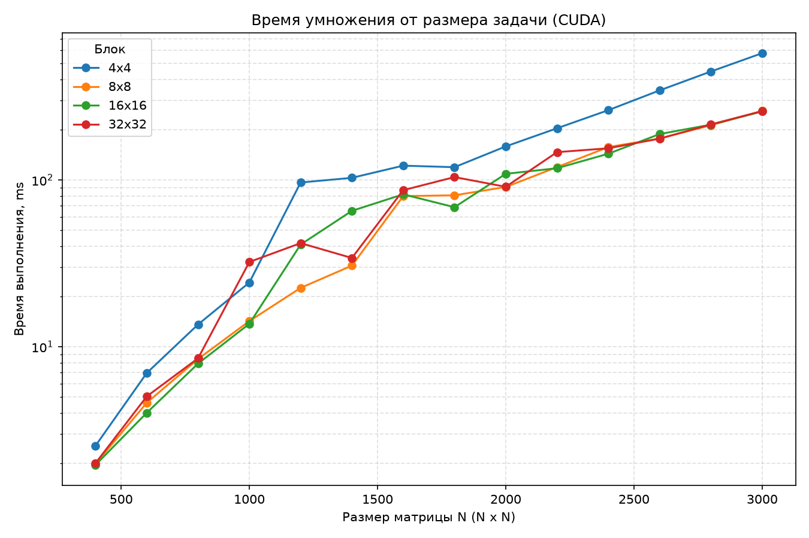
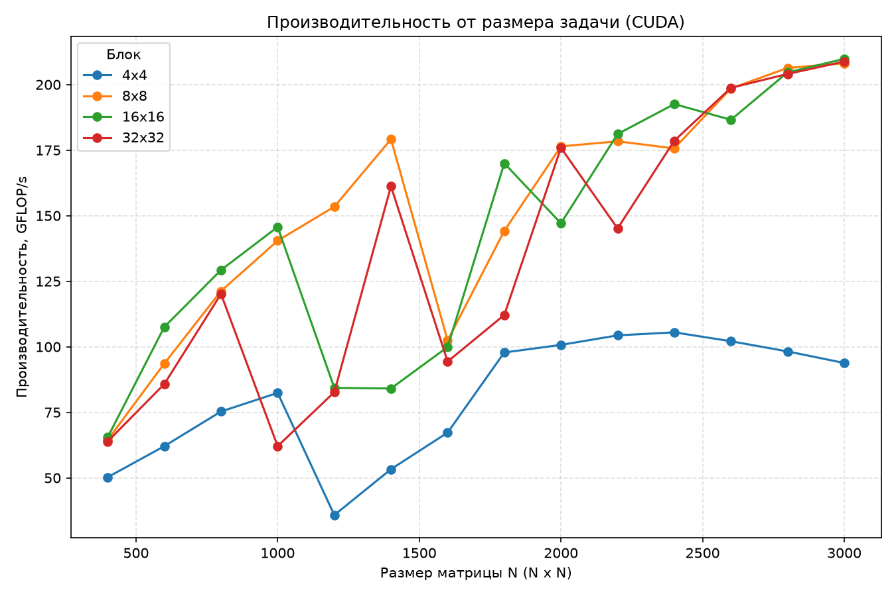
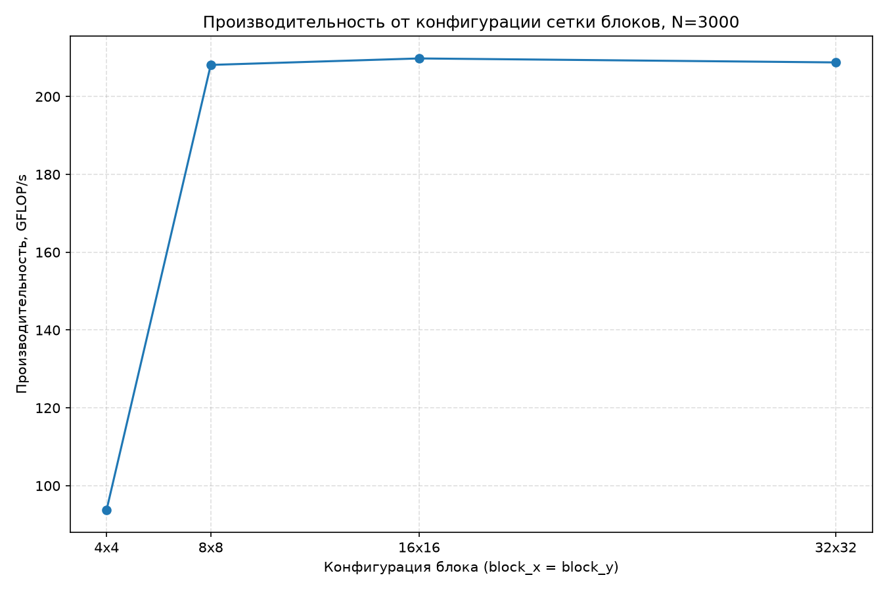

# Лабораторная работа 4

Общие требования, подход к исследованию и замерам описаны в [корневом README.md](../../README.md).

## Задача

Реализовать умножение двух матриц с использованием CUDA и исследовать зависимость времени выполнения и производительности алгоритма от размера матриц и конфигурации блока потоков.

В рамках работы необходимо:

* реализовать умножение матриц на GPU;
* исследовать несколько размеров матриц;
* исследовать различные размеры CUDA-блоков;
* измерить время выполнения и производительность;
* проверить корректность полученных результатов при помощи Python и NumPy.

## Алгоритм

Пусть матрица `A` имеет размер `n × m`, матрица `B` — `m × p`. В результате умножения получается матрица `C` размера `n × p`.

Перед началом вычислений выполняется проверка возможности умножения:

```cpp
matrix::Matrix::check_multiplicable(a, b);
```

После этого определяются размеры матриц:

```cpp
const std::uint32_t n = a.get_rows();
const std::uint32_t m = a.get_columns();
const std::uint32_t p = b.get_columns();
```

где:

* `n` — количество строк матрицы `A`;
* `m` — количество столбцов матрицы `A` и строк матрицы `B`;
* `p` — количество столбцов матрицы `B`.

Результирующая матрица создаётся с размером `n × p`:

```cpp
matrix::Matrix result(n, p);
```

### Выделение памяти

Для каждой матрицы вычисляется необходимый объём памяти:

```cpp
const std::size_t bytes_a = static_cast<std::size_t>(n) * m * sizeof(double);

const std::size_t bytes_b = static_cast<std::size_t>(m) * p * sizeof(double);

const std::size_t bytes_c = static_cast<std::size_t>(n) * p * sizeof(double);
```

После этого создаются буферы в памяти GPU:

```cpp
cuda_detail::DeviceBuffer d_a(bytes_a);
cuda_detail::DeviceBuffer d_b(bytes_b);
cuda_detail::DeviceBuffer d_c(bytes_c);
```

### Копирование данных на GPU

Матрицы `A` и `B` копируются из памяти CPU в память GPU:

```cpp
cuda_detail::check(cudaMemcpy(d_a.get(), a.data(), bytes_a, cudaMemcpyHostToDevice), "cudaMemcpy(matrix_a, H2D)");

cuda_detail::check(cudaMemcpy(d_b.get(), b.data(), bytes_b, cudaMemcpyHostToDevice), "cudaMemcpy(matrix_b, H2D)");
```

Таким образом, перед запуском CUDA-ядра исходные матрицы находятся в памяти устройства.

### Настройка блока и сетки

Размер блока потоков задаётся параметрами `_block_x` и `_block_y`:

```cpp
const dim3 block(_block_x, _block_y);
```

Количество блоков в сетке рассчитывается с округлением вверх:

```cpp
const dim3 grid((p + block.x - 1) / block.x, (n + block.y - 1) / block.y);
```

Координата `x` соответствует столбцам результирующей матрицы, а координата `y` — строкам.

Таким образом, сетка покрывает все `n × p` элементов результирующей матрицы.

### Выполнение CUDA-ядра

После настройки сетки запускается ядро:

```cpp
cuda_detail::multiply_kernel<<<grid, block>>>(d_a.get(), d_b.get(), d_c.get(), n, m, p);
```

В основе вычислений используется классическая формула матричного умножения:

$$
C_{ij} = \sum_{k=0}^{m-1} A_{ik}B_{kj}
$$

Каждый CUDA-поток отвечает за вычисление одного элемента результирующей матрицы `C`.

После запуска ядра проверяется наличие ошибки:

```cpp
cuda_detail::check(cudaGetLastError(), "запуск ядра multiply_kernel");
```

Затем выполняется синхронизация устройства:

```cpp
cuda_detail::check(cudaDeviceSynchronize(), "cudaDeviceSynchronize");
```

Синхронизация гарантирует завершение вычислений перед копированием результата обратно на CPU.

### Копирование результата

После завершения вычислений матрица `C` копируется из памяти GPU в память CPU:

```cpp
cuda_detail::check(cudaMemcpy(result.data(), d_c.get(), bytes_c, cudaMemcpyDeviceToHost), "cudaMemcpy(result, D2H)");
```

После этого функция возвращает результат:

```cpp
return result;
```

### Общая последовательность алгоритма

1. Проверка совместимости матриц `A` и `B`.
2. Определение размеров `n`, `m` и `p`.
3. Создание результирующей матрицы `C`.
4. Выделение памяти GPU для `A`, `B` и `C`.
5. Копирование `A` и `B` с CPU на GPU.
6. Формирование размера CUDA-блока.
7. Расчёт размера CUDA-сетки.
8. Запуск `multiply_kernel`.
9. Проверка запуска ядра.
10. Ожидание завершения вычислений.
11. Копирование `C` с GPU на CPU.
12. Возврат результирующей матрицы.

### Предварительная оценка алгоритма

Для квадратных матриц размера `N × N` выполняется порядка `N³` операций:

$$
O(N^3)
$$

Количество операций с плавающей точкой оценивается как:

$$
FLOPs = 2N^3
$$

где учитываются умножения и сложения.

Объём памяти для хранения трёх матриц типа `double` составляет:

$$
M = 3N^2 \cdot 8
$$

байт.

Например, для `N = 3000` это:

$$
3 \cdot 3000^2 \cdot 8 = 216\,000\,000
$$

байт, то есть около `216 MB`.

## Технические характеристики устройств

```text
Kernel: Linux 6.18.48-1-cachyos-lts
Shell: fish 4.9.3

CPU: AMD Ryzen 5 7535HS (12) @ 4.60 GHz

GPU 1: NVIDIA GeForce RTX 4060 Max-Q / Mobile [Discrete]
GPU 2: AMD Radeon 680M [Integrated]

Memory: 14.86 GiB
```

## Результат

Все 56 запусков были признаны корректными (`valid = True`).

Максимальная абсолютная ошибка по всем запускам составила примерно:

```text
5,28·10⁻¹¹
```

что значительно меньше установленного допуска:

```text
atol = 1e-6
```

Таким образом, проверка показала соответствие результатов CUDA-реализации эталонному вычислению.

### Время выполнения, с

|    N |    4 × 4 |    8 × 8 |  16 × 16 |  32 × 32 |
| ---: | -------: | -------: | -------: | -------: |
|  400 | 0.002547 | 0.001985 | 0.001954 | 0.002003 |
|  600 | 0.006957 | 0.004614 | 0.004016 | 0.005035 |
|  800 | 0.013598 | 0.008445 | 0.007922 | 0.008523 |
| 1000 | 0.024266 | 0.014240 | 0.013727 | 0.032212 |
| 1200 | 0.096506 | 0.022528 | 0.040977 | 0.041788 |
| 1400 | 0.102952 | 0.030633 | 0.065261 | 0.034041 |
| 1600 | 0.121776 | 0.079978 | 0.081977 | 0.086805 |
| 1800 | 0.119232 | 0.080883 | 0.068616 | 0.104029 |
| 2000 | 0.158862 | 0.090692 | 0.108777 | 0.090965 |
| 2200 | 0.204085 | 0.119392 | 0.117562 | 0.146751 |
| 2400 | 0.262043 | 0.157399 | 0.143584 | 0.154821 |
| 2600 | 0.344253 | 0.177062 | 0.188418 | 0.176863 |
| 2800 | 0.446954 | 0.212762 | 0.214532 | 0.215159 |
| 3000 | 0.575582 | 0.259454 | 0.257398 | 0.258657 |

С увеличением размера матрицы время выполнения возрастает приблизительно как `N³`, что соответствует вычислительной сложности алгоритма.

При небольших размерах матриц разница между конфигурациями блока сравнительно невелика. При увеличении `N` преимущество блоков `8 × 8`, `16 × 16` и `32 × 32` становится заметнее по сравнению с `4 × 4`.

### Производительность, GFLOP/с

|    N |  4 × 4 |  8 × 8 | 16 × 16 | 32 × 32 |
| ---: | -----: | -----: | ------: | ------: |
|  400 |  50.25 |  64.48 |   65.51 |   63.92 |
|  600 |  62.10 |  93.63 |  107.56 |   85.80 |
|  800 |  75.31 | 121.25 |  129.26 |  120.15 |
| 1000 |  82.42 | 140.45 |  145.70 |   62.09 |
| 1200 |  35.81 | 153.41 |   84.34 |   82.70 |
| 1400 |  53.31 | 179.16 |   84.09 |  161.22 |
| 1600 |  67.27 | 102.43 |   99.93 |   94.37 |
| 1800 |  97.83 | 144.21 |  169.99 |  112.12 |
| 2000 | 100.72 | 176.42 |  147.09 |  175.89 |
| 2200 | 104.35 | 178.37 |  181.15 |  145.12 |
| 2400 | 105.51 | 175.66 |  192.56 |  178.58 |
| 2600 | 102.11 | 198.53 |  186.56 |  198.75 |
| 2800 |  98.23 | 206.35 |  204.65 |  204.05 |
| 3000 |  93.82 | 208.13 |  209.79 |  208.77 |

Производительность в GFLOP/с рассчитывалась по формуле:

$$
P = \frac{2N^3}{T \cdot 10^9}
$$

где `T` — время выполнения умножения.

На больших размерах матриц производительность блоков `8 × 8`, `16 × 16` и `32 × 32` становится близкой. Для `N = 3000` значения составляют соответственно:

* `8 × 8` — `208.13 GFLOP/с`;
* `16 × 16` — `209.79 GFLOP/с`;
* `32 × 32` — `208.77 GFLOP/с`.

## Пиковая производительность

| Размер блока | Пиковая производительность, GFLOP/с | Конфигурация |
| ------------ | ----------------------------------: | ------------ |
| 4 × 4        |                              105.51 | N = 2400     |
| 8 × 8        |                              208.13 | N = 3000     |
| 16 × 16      |                              209.79 | N = 3000     |
| 32 × 32      |                              208.77 | N = 3000     |

Максимальное измеренное значение производительности составило `209.79 GFLOP/с` для блока `16 × 16` при размере матрицы `N = 3000`.

## Анализ графиков

Графики построены с помощью Python и библиотеки Matplotlib.



Рисунок 1 — Зависимость времени выполнения от размера матрицы при разных размерах CUDA-блока

Время выполнения увеличивается с ростом размера матрицы. Для больших `N` конфигурации `8 × 8`, `16 × 16` и `32 × 32` демонстрируют близкое время выполнения, тогда как блок `4 × 4` в большинстве случаев работает заметно дольше.

При отдельных размерах наблюдаются локальные отклонения, например при `N = 1200` для блока `4 × 4` и при `N = 1000` для блока `32 × 32`. Такие различия отражают зависимость производительности GPU от конкретной конфигурации сетки и размера задачи.



Рисунок 2 — Зависимость производительности от размера матрицы при разных размерах CUDA-блока

При увеличении размера матрицы производительность в целом возрастает. Для небольших `N` заметно влияние накладных расходов запуска CUDA и передачи данных, поэтому GPU используется менее эффективно.

Начиная примерно с `N = 2000`, конфигурации `8 × 8`, `16 × 16` и `32 × 32` демонстрируют производительность порядка `175–210 GFLOP/с`.



Рисунок 3 — Производительность для различных размеров CUDA-блока

Для блока `4 × 4` производительность на больших размерах матриц заметно ниже, чем для остальных конфигураций. При `N = 3000` разница составляет более двух раз: `93.82 GFLOP/с` против примерно `209 GFLOP/с` для блоков `8 × 8`, `16 × 16` и `32 × 32`.

При этом дальнейшее увеличение блока с `16 × 16` до `32 × 32` не приводит к заметному росту производительности на больших размерах задачи.

## Выводы

* Реализовано умножение матриц с использованием CUDA, при котором отдельные CUDA-потоки вычисляют элементы результирующей матрицы.
* Исследовано 56 конфигураций: 14 размеров матриц и 4 размера CUDA-блока.
* Все 56 запусков прошли проверку корректности (`valid = True`).
* Максимальная абсолютная ошибка составила примерно `5,28·10⁻¹¹` при допустимом значении `atol = 1e-6`.
* Время выполнения увеличивается с ростом размера матрицы, что соответствует кубической вычислительной сложности классического алгоритма матричного умножения.
* На больших размерах матриц блок `4 × 4` показывает меньшую производительность по сравнению с блоками `8 × 8`, `16 × 16` и `32 × 32`.
* Для `N = 3000` производительность блоков `8 × 8`, `16 × 16` и `32 × 32` находится примерно на одном уровне — около `208–210 GFLOP/с`.
* Максимальная измеренная производительность составила `209.79 GFLOP/с` для блока `16 × 16` при `N = 3000`.
* Увеличение размера блока с `16 × 16` до `32 × 32` на исследованных больших размерах не дало заметного прироста производительности.

**Полные результаты** находятся в [general.csv](../../results/lab_04/general.csv), агрегированные таблицы — в [tables.md](tables.md).